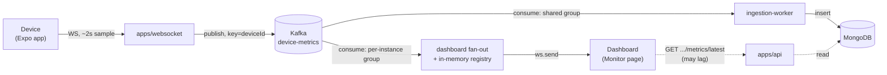

# monitoring-platform

A full-stack, real-time device-monitoring platform: a React web dashboard, an Expo mobile app,
and a four-process backend built around Kafka-driven live delivery, JWT + scoped RBAC, and a
Postgres/MongoDB/Kafka/ClickHouse data layer — plus a fifth, unrelated Electron app shipped
through its own CI-built installer pipeline.

[](https://www.typescriptlang.org/)
[](https://react.dev/)
[](https://nestjs.com/)
[](https://kafka.apache.org/)
[](https://www.postgresql.org/)
[](https://www.mongodb.com/)
[](https://www.docker.com/)
[](https://aws.amazon.com/ecs/)
[](https://expo.dev/)
[](https://www.electronjs.org/)

## What it is

A SaaS product for organizations that need to monitor a fleet of Android devices — kiosks,
handheld scanners, point-of-sale phones — across multiple sites. An admin creates an account,
which provisions a tenant with a workspace/location hierarchy; from the dashboard they generate a
QR pairing code scoped to a location, a phone scans it, and that device starts streaming live
battery/memory/disk/CPU stats to a Monitor page in real time. Role-based access controls who can
see or manage which devices, at which sites, across the organization.

## Why it's worth a look

- **Full-stack across four platforms** — a React web dashboard, an Expo/React Native mobile app,
  a Nest + plain-TypeScript backend (its own four-process monorepo), and a standalone Electron
  desktop app with its own auto-built, auto-released installers.
- **A real event-streaming pipeline, not just CRUD** — device metrics flow through Kafka to two
  consumer groups with *opposite* scaling semantics from the same topic: a shared group that
  shards partitions across instances for durable writes (no two instances ever double-process the
  same partition), and a per-process group that broadcasts a full copy of the stream for
  in-memory dashboard fan-out. See the diagram below.
- **A deliberate availability/consistency split** — live delivery to a dashboard never waits on a
  database write, and that write never waits on live delivery either. Two independent paths to
  the same data, on purpose.
- **Real multi-tenant authorization** — JWT access + refresh tokens, and scoped RBAC that
  cascades tenant → workspace → location, resolved fresh from Postgres on every request (never
  cached in the token, so a permission change is instant).
- **Actually deployed, not just runnable** — a multi-stage Docker build with one target per
  backend process, CI that type-checks and builds every PR, CD that ships to AWS ECS on merge to
  `main`, and a separate pipeline that builds and releases Windows/Linux desktop installers
  (unsigned for now) to GitHub Releases + S3.

## How the live pipeline works



One Kafka topic, keyed by device id so a device's messages always land on the same partition. The
solid path is the live, WebSocket-driven route; the dashed path is a REST fallback that's always
answerable but may lag by however long the durable write took. Full write-up, including *why* a
topic-per-device would be an anti-pattern here: [`docs/ARCHITECTURE.md`](docs/ARCHITECTURE.md) and
the interactive version, [`docs/architecture.html`](docs/architecture.html).

## Tech stack

| Layer | Stack |
| --- | --- |
| Backend API | NestJS, TypeORM, Swagger, Joi-validated config |
| Real-time / workers | Plain TypeScript, `ws`, KafkaJS |
| Data | PostgreSQL (system of record), MongoDB (metrics stream), Kafka (live transport), Redis + ClickHouse (provisioned, not yet load-bearing) |
| Web | React, Vite, TypeScript, React Router |
| Mobile | Expo, React Native, `expo-camera`/`expo-battery`/`expo-device`/`expo-file-system` |
| Desktop | Electron, React, `electron-vite`, `electron-builder` |
| Infra / CI-CD | Docker (multi-stage, 4 targets), Docker Compose, GitHub Actions, AWS ECS/ECR, S3 |

## Try it locally

```bash
docker compose up -d postgres mongo redis kafka clickhouse

cd backend && pnpm install && cp .env.example .env
pnpm migration:run && pnpm seed:demo     # prints demo login credentials
pnpm dev:api & pnpm dev:websocket & pnpm dev:ingestion-worker & pnpm dev:cron-worker

cd ../frontend && pnpm install && pnpm dev   # http://localhost:5173
```

Register an account, click **Connect Device**, then simulate a phone without needing hardware:

```bash
node scripts/simulate-device.js --code 123456   # the code shown on the dashboard
```

The Monitor page updates live. Full quickstart (including the real Expo app and the standalone
desktop app) is in [`backend/README.md`](backend/README.md) and each directory's own `README.md`.

## Docs

- [`docs/ARCHITECTURE.md`](docs/ARCHITECTURE.md) — the full technical write-up: component roles,
  the auth/RBAC model, the pairing flow, and the live-metrics pipeline end to end.
- [`docs/architecture.html`](docs/architecture.html) — the same system as an interactive,
  diagram-based reference (open directly in a browser).
- `backend/README.md` and each `apps/*`/`packages/*`/platform directory's own `README.md` —
  implementation detail for that specific piece.

## Current state

This is a working system, developed in deliberate passes rather than all at once — a few things
are honest work-in-progress rather than oversights:

- **`frontend/`/`mobile/` haven't been updated for the backend's latest auth contract yet** —
  pairing now requires an authenticated caller + `locationId`, login/register now also return a
  `refresh_token`, and the WebSocket server moved to its own port. Backend-only change so far.
- **CPU on mobile is a JS-thread-load proxy, not a real percentage** — Android exposes no
  permission-free way to read true system CPU load; this measures timer overshoot instead.
- **Redis and ClickHouse are provisioned but idle** — Kafka replaced Redis as the metrics
  transport; ClickHouse has its connection/migration mechanism wired up but no application data
  written yet.
- **Scoped RBAC is an initial pass** — a global (not per-tenant) permission catalog, and scope
  resolution follows a documented route convention rather than a fully generic resolver.

Full detail on all of these, and the reasoning behind each: [`docs/ARCHITECTURE.md`](docs/ARCHITECTURE.md#known-trade-offs-by-design-not-oversights).

---

Built by [@mj-praba](https://github.com/mj-praba).
